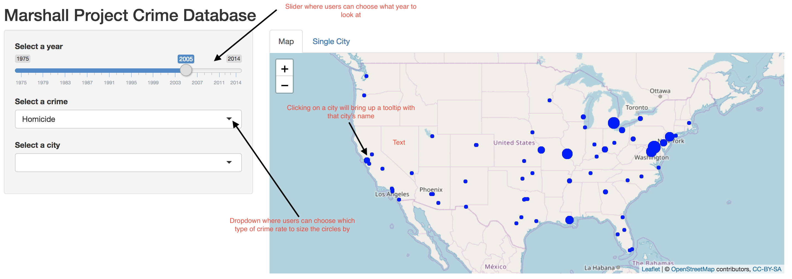

# Screenshots

### Map Tab

### Single City Tab

# Rationale
Our rationale for this app was to give users (particularly U.S. policy makers) a sense of the national crime picture over time in our Map tab, and then let them drill down and understand specific local trends for each city in our 'Single City' tab.

For the Map tab, we used leaflet to plot a circle for each city in our dataset, and sized the circle by the rate of crime in that city. We allow user to filter on year (using a slider, so they can easily view trends over time) and filter on type of crime (homicide, robbery, etc.; we also including 'Total Crime', which is all of the crime rates added together).

Once a user finds an interesting trend that they want to drill down on, they can go to the 'Single City' tab and see the crime trends over time for each city. This will allow a user to get the rest of the picture that's missing from the map tab: comparing all of the different kinds of crime rates side-by-side, and getting exact numbers of the rate of each crime. We've also added a bar graph for population on the same graph because we take it to be a major factor influencing the crime rate. We also have a table at the bottom that shows the user year-over-year trends for each crime (the user can choose what year they want to look at) and the Safety Rank (where the city ranks in total crime for that year compared with all of the other cities) for the selected city and year.

# Tasks
These were the tasks at hand for Milestone 2:

* Build Map tab
    * Create map of the United States and add circles to each U.S. city sized by crime rate.
    * Add city name to tooltip so users can confirm they're looking at the right city.
* Build 'Single City' tab
    * Create line graph with each of the crime rates over time for each city.
    * Create table with year-over-year and Safety Rank stats as described above.
* Create Sidepanel for the ability in both tabs to filter data by year, type of crime, and city (just used for 'Single City' tab) and update plot and map accordingly.

# Vision & Next Steps
Our goal for the next milestone is to make the app more intuitive and user-friendly so that it can be used to its full potential. We have a number of ideas for features to implement that will achieve these goals, but we will also rely on peer review of our app to help guide this process.

Our ideas for features include: centering the map on the continental U.S. to make it easier for the user to read; making a Makefile so that the user can re-run our analysis (including the code cleaning); adding a more descriptive README.md; improving the color scheme for both tabs; putting a written introduction on how to use the app at the top of the app; explaining the filters and how to use them in the app; adding more information to the tooltip than just city name.

There are also a few bugs that we're still addressing. Although we've fixed most of these kind of issues, it looks like a few cities are slightly out of place. Also, when a city isn't selected nothing pops up in the 'Single City' tab (we want to change it so there is a default selected).
